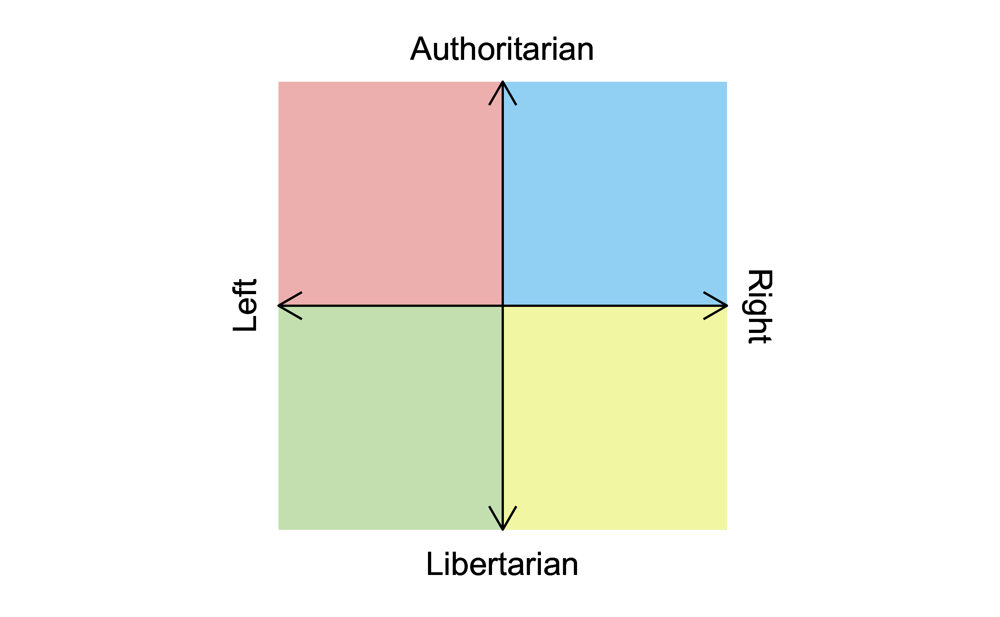
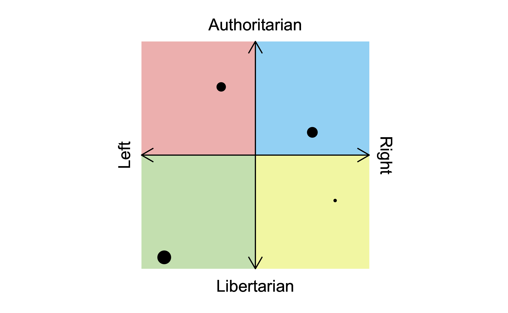

# Introduction to `ggmemes`
Automated art for the 21st century

**Author**: Ethan Milne, PhD Student (Marketing/Consumer Behavior), Ivey Business School

**Purpose**: Personal amusement

---
 
# Political Compass Format

Suppose you have a dataframe df, and want to create a political compass based on it. With `gg_politicalcompass()`, doing this can be done in only a couple lines of code. First, you need to initialize a ggplot object, shown below:

```
gg_politicalcompass(data = df)
```

This results in the following output:


To add data to this plot, you can use the pre-existing `ggplot` function, `geom_point`:

```
gg_politicalcompass(data = data) +
  geom_point(aes(x = x,
                 y = y,
                 size = value))
```

This results in the following output:


Labels can be changed with the optional parameters "top", "bottom", "left", and "right" within the function call. For example:

```
gg_politicalcompass(data = data,
                    top = "good",
                    bottom = "evil",
                    left = "chaotic",
                    right = "lawful"
                    )
 
```


---

# Installation

You can install `ggmemes` with the following code:

```{r}
install.packages("devtools") # if you have not installed "devtools" package
devtools::install_github("SEthanMilne/ggmemes")
```

---

# Citation

I'm sure this will be used in many peer-reviewed publications. To that end, the citation for `ggmemes` can be found below:

```{r}
To cite package ‘ggmemes’ in publications use:

  Ethan Milne (2022). ggmemes. R package version
  0.1.0.

A BibTeX entry for LaTeX users is

  @Manual{,
    title = {ggmemes},
    author = {Ethan Milne},
    year = {2022},
    note = {R package version 0.1.0},
  }

```
